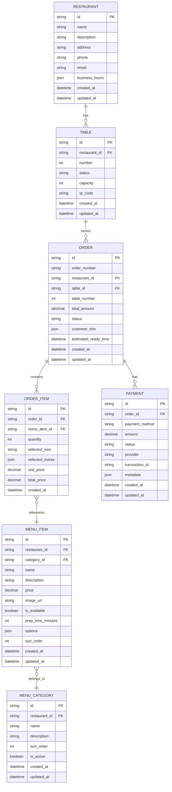

# 🔧 Study OnTable 백엔드 API 설계

## 📋 개요

Study OnTable 프로젝트의 백엔드 API 아키텍처 설계 문서입니다. 현재 프론트엔드에서 정의된 API 인터페이스를 기반으로 실제 백엔드 구현을 위한 상세 설계를 제공합니다.

## 🏗 전체 아키텍처

### 기술 스택 제안
- **Runtime**: Node.js (TypeScript)
- **Framework**: Express.js + TypeScript
- **Database**: PostgreSQL (주문/메뉴 데이터) + Redis (세션/캐시)
- **ORM**: Prisma
- **Authentication**: JWT
- **File Storage**: AWS S3 (메뉴 이미지)
- **Real-time**: Socket.IO (주문 상태 업데이트)
- **Payment**: 토스페이먼츠 API 연동

### 프로젝트 구조
```
backend/
├── src/
│   ├── controllers/     # API 컨트롤러
│   ├── services/        # 비즈니스 로직
│   ├── models/          # 데이터 모델 (Prisma)
│   ├── routes/          # 라우팅
│   ├── middleware/      # 미들웨어
│   ├── utils/           # 유틸리티
│   ├── types/           # TypeScript 타입
│   └── config/          # 설정
├── prisma/              # 데이터베이스 스키마
├── tests/               # 테스트
└── docs/                # API 문서
```

## 📊 데이터베이스 설계

### ERD (Entity Relationship Diagram)



### Prisma Schema

```prisma
// prisma/schema.prisma

generator client {
  provider = "prisma-client-js"
}

datasource db {
  provider = "postgresql"
  url      = env("DATABASE_URL")
}

model Restaurant {
  id            String   @id @default(cuid())
  name          String
  description   String?
  address       String
  phone         String
  email         String
  businessHours Json?
  createdAt     DateTime @default(now())
  updatedAt     DateTime @updatedAt

  tables        Table[]
  menuCategories MenuCategory[]
  menuItems     MenuItem[]
  orders        Order[]

  @@map("restaurants")
}

model Table {
  id           String   @id @default(cuid())
  restaurantId String
  number       Int
  status       TableStatus @default(AVAILABLE)
  capacity     Int
  qrCode       String   @unique
  createdAt    DateTime @default(now())
  updatedAt    DateTime @updatedAt

  restaurant   Restaurant @relation(fields: [restaurantId], references: [id])
  orders       Order[]

  @@unique([restaurantId, number])
  @@map("tables")
}

model MenuCategory {
  id           String   @id @default(cuid())
  restaurantId String
  name         String
  description  String?
  sortOrder    Int      @default(0)
  isActive     Boolean  @default(true)
  createdAt    DateTime @default(now())
  updatedAt    DateTime @updatedAt

  restaurant   Restaurant @relation(fields: [restaurantId], references: [id])
  menuItems    MenuItem[]

  @@unique([restaurantId, name])
  @@map("menu_categories")
}

model MenuItem {
  id              String   @id @default(cuid())
  restaurantId    String
  categoryId      String
  name            String
  description     String
  price           Decimal
  imageUrl        String?
  isAvailable     Boolean  @default(true)
  prepTimeMinutes Int      @default(10)
  options         Json?
  sortOrder       Int      @default(0)
  createdAt       DateTime @default(now())
  updatedAt       DateTime @updatedAt

  restaurant      Restaurant    @relation(fields: [restaurantId], references: [id])
  category        MenuCategory  @relation(fields: [categoryId], references: [id])
  orderItems      OrderItem[]

  @@map("menu_items")
}

model Order {
  id                  String   @id @default(cuid())
  orderNumber         String   @unique
  restaurantId        String
  tableId             String
  tableNumber         Int
  totalAmount         Decimal
  status              OrderStatus @default(PENDING)
  customerInfo        Json?
  estimatedReadyTime  DateTime?
  createdAt           DateTime @default(now())
  updatedAt           DateTime @updatedAt

  restaurant          Restaurant @relation(fields: [restaurantId], references: [id])
  table               Table      @relation(fields: [tableId], references: [id])
  items               OrderItem[]
  payments            Payment[]

  @@map("orders")
}

model OrderItem {
  id              String   @id @default(cuid())
  orderId         String
  menuItemId      String
  quantity        Int
  selectedSize    String?
  selectedExtras  Json?
  unitPrice       Decimal
  totalPrice      Decimal
  createdAt       DateTime @default(now())

  order           Order    @relation(fields: [orderId], references: [id])
  menuItem        MenuItem @relation(fields: [menuItemId], references: [id])

  @@map("order_items")
}

model Payment {
  id            String   @id @default(cuid())
  orderId       String
  paymentMethod PaymentMethod
  amount        Decimal
  status        PaymentStatus @default(PENDING)
  provider      String
  transactionId String?
  metadata      Json?
  createdAt     DateTime @default(now())
  updatedAt     DateTime @updatedAt

  order         Order    @relation(fields: [orderId], references: [id])

  @@map("payments")
}

enum TableStatus {
  AVAILABLE
  OCCUPIED
  RESERVED
  CLEANING
}

enum OrderStatus {
  PENDING
  CONFIRMED
  PREPARING
  READY
  SERVED
  CANCELLED
}

enum PaymentMethod {
  CARD
  MOBILE
  CASH
}

enum PaymentStatus {
  PENDING
  COMPLETED
  FAILED
  CANCELLED
  REFUNDED
}
```

## 🛣 API 엔드포인트 설계

### 1. 메뉴 관리 API

#### `GET /api/menu`
메뉴 목록 조회 (고객/관리자)

**Query Parameters:**
- `category?: string` - 카테고리 필터
- `page?: number` - 페이지 번호 (기본값: 1)
- `limit?: number` - 페이지 크기 (기본값: 20)
- `search?: string` - 검색어
- `isAvailable?: boolean` - 판매 가능 여부

**Response:**
```json
{
  "success": true,
  "data": [
    {
      "id": "menu_123",
      "name": "마르게리타 피자",
      "description": "신선한 토마토 소스와 모차렐라 치즈",
      "price": 18000,
      "category": "pizza",
      "image": "https://cdn.example.com/pizza1.jpg",
      "isAvailable": true,
      "prepTime": 15,
      "options": {
        "sizes": [
          { "name": "미디움", "price": 0 },
          { "name": "라지", "price": 5000 }
        ],
        "extras": [
          { "name": "올리브", "price": 2000 },
          { "name": "치즈 추가", "price": 2500 }
        ]
      }
    }
  ],
  "pagination": {
    "page": 1,
    "limit": 20,
    "total": 45,
    "totalPages": 3
  }
}
```

#### `GET /api/menu/:id`
특정 메뉴 상세 조회

#### `POST /api/menu` (관리자 전용)
새 메뉴 아이템 생성

#### `PUT /api/menu/:id` (관리자 전용)
메뉴 아이템 수정

#### `DELETE /api/menu/:id` (관리자 전용)
메뉴 아이템 삭제

### 2. 주문 관리 API

#### `POST /api/orders`
새 주문 생성

**Request Body:**
```json
{
  "tableNumber": 7,
  "items": [
    {
      "menuItemId": "menu_123",
      "quantity": 2,
      "selectedSize": "라지",
      "selectedExtras": ["올리브", "치즈 추가"],
      "unitPrice": 23000,
      "totalPrice": 46000
    }
  ],
  "paymentMethod": "card",
  "totalAmount": 46000,
  "customerInfo": {
    "name": "김고객",
    "phone": "01012345678",
    "email": "customer@example.com"
  }
}
```

**Response:**
```json
{
  "success": true,
  "data": {
    "id": "order_456",
    "orderNumber": "T7-240930001",
    "tableNumber": 7,
    "status": "pending",
    "totalAmount": 46000,
    "estimatedReadyTime": "2024-09-30T12:15:00Z",
    "items": [...]
  }
}
```

#### `GET /api/orders`
주문 목록 조회 (관리자)

**Query Parameters:**
- `status?: string` - 주문 상태 필터
- `tableNumber?: number` - 테이블 번호 필터
- `startDate?: string` - 시작 날짜
- `endDate?: string` - 종료 날짜

#### `GET /api/orders/:id`
특정 주문 상세 조회

#### `PATCH /api/orders/:id/status`
주문 상태 업데이트 (관리자)

**Request Body:**
```json
{
  "status": "preparing",
  "estimatedReadyTime": "2024-09-30T12:15:00Z"
}
```

#### `PATCH /api/orders/:id/cancel`
주문 취소

### 3. 테이블 관리 API

#### `GET /api/tables`
테이블 목록 조회

#### `GET /api/tables/:id`
특정 테이블 조회

#### `GET /api/tables/:tableNumber/current-order`
테이블의 현재 주문 조회

#### `PATCH /api/tables/:id/status`
테이블 상태 업데이트

### 4. 결제 API

#### `POST /api/payments`
결제 처리

#### `GET /api/payments/:id`
결제 상세 조회

#### `POST /api/payments/:id/refund`
결제 환불

### 5. 관리자 API

#### `GET /api/admin/dashboard`
대시보드 데이터

#### `GET /api/admin/analytics`
매출 분석 데이터

#### `GET /api/admin/orders/real-time`
실시간 주문 현황

## 🔒 인증 및 권한

### JWT 토큰 구조
```json
{
  "sub": "user_123",
  "role": "admin|customer",
  "restaurantId": "restaurant_456",
  "tableNumber": 7,
  "iat": 1727692800,
  "exp": 1727779200
}
```

### 권한 레벨
- **Customer**: 테이블별 주문 관리
- **Staff**: 주문 상태 관리
- **Admin**: 전체 시스템 관리

## 🔄 실시간 기능

### Socket.IO 이벤트

#### 서버 → 클라이언트
- `order:status_updated` - 주문 상태 변경
- `order:new` - 새 주문 접수
- `table:status_updated` - 테이블 상태 변경

#### 클라이언트 → 서버
- `order:subscribe` - 주문 상태 구독
- `table:subscribe` - 테이블 상태 구독

## 🧪 테스트 전략

### 단위 테스트
- Service 레이어 로직 테스트
- Model 유효성 검사 테스트

### 통합 테스트
- API 엔드포인트 테스트
- 데이터베이스 연동 테스트

### E2E 테스트
- 주문 플로우 전체 테스트
- 결제 연동 테스트

## 📋 구현 우선순위

### Phase 1: 핵심 기능 (2주) ✅ **완료** (2025.10.03)
1. ✅ 메뉴 조회 API - `server/routes/menu.js`
2. ✅ 주문 생성/조회 API - `server/routes/orders.js`
3. ✅ 테이블 관리 API - `server/routes/tables.js`
4. ✅ MySQL 데이터베이스 연동 - `server/database/connection.js`
5. ✅ 트랜잭션 처리 구현

### Phase 2: 고급 기능 (2주)
1. 🔄 실시간 주문 상태 업데이트 (Socket.IO)
2. ✅ 토스페이먼츠 연동 - `server/payment.js`
3. 📊 관리자 대시보드
4. 📱 QR 코드 생성

### Phase 3: 최적화 (1주)
1. 🚀 캐싱 시스템 (Redis)
2. 📈 성능 모니터링
3. 🔒 보안 강화
4. 📚 API 문서 완성 (Swagger)

## 🚀 배포 및 인프라

### 개발 환경
- **Local**: Docker Compose
- **Database**: PostgreSQL 컨테이너
- **Cache**: Redis 컨테이너

### 프로덕션 환경
- **Platform**: AWS/Heroku
- **Database**: RDS PostgreSQL
- **Cache**: ElastiCache Redis
- **File Storage**: S3
- **Load Balancer**: ALB

## 📝 API 문서화

### Swagger/OpenAPI 3.0
- 자동 생성된 API 문서
- 인터랙티브 테스트 환경
- 타입 안전성 보장

### 문서 구조
- 엔드포인트별 상세 설명
- 요청/응답 예시
- 에러 코드 정의
- 인증 방법 가이드

---

## 🎯 구현 현황 요약 (2025.10.03)

### ✅ 구현 완료된 API

#### 메뉴 API (3개)
- `GET /api/menu` - 메뉴 목록 조회 (필터링, 페이지네이션)
- `GET /api/menu/:id` - 메뉴 상세 조회
- `GET /api/menu/categories/list` - 카테고리 목록

#### 주문 API (5개)
- `POST /api/orders` - 주문 생성 (트랜잭션 처리)
- `GET /api/orders` - 주문 목록 조회 (관리자)
- `GET /api/orders/:id` - 주문 상세 조회
- `PATCH /api/orders/:id/status` - 주문 상태 업데이트
- `PATCH /api/orders/:id/cancel` - 주문 취소

#### 테이블 API (4개)
- `GET /api/tables` - 테이블 목록 조회
- `GET /api/tables/:tableNumber/current-order` - 현재 주문 조회
- `GET /api/tables/:tableNumber/history` - 주문 히스토리
- `GET /api/tables/:tableNumber/status` - 테이블 상태

#### 결제 API (3개)
- `POST /api/payments/confirm` - 결제 승인
- `GET /api/payments/:paymentKey` - 결제 조회
- `POST /api/payments/:paymentKey/cancel` - 결제 취소

### 🔧 구현된 인프라
- **Express 서버**: 모듈화된 라우터 구조
- **MySQL 연결**: Connection Pool + 트랜잭션 지원
- **에러 처리**: 전역 에러 핸들러
- **환경 변수**: dotenv 기반 설정 관리

### 📂 프로젝트 구조
```
server/
├── routes/
│   ├── menu.js          # 메뉴 관리 API
│   ├── orders.js        # 주문 관리 API
│   └── tables.js        # 테이블 관리 API
├── database/
│   ├── connection.js    # MySQL 연결 관리
│   └── schema.sql       # 데이터베이스 스키마
├── app.js              # Express 메인 서버
└── payment.js          # 토스페이먼츠 연동
```

---

**현재 단계**: Phase 1 완료, Phase 2 진행 중 (프론트엔드 연동 필요)